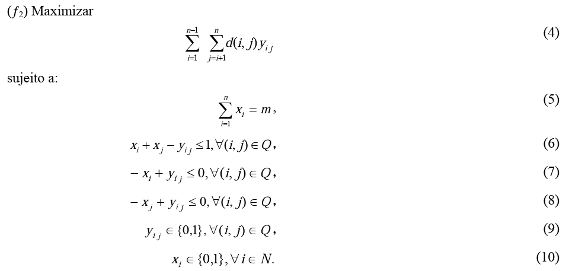

# O Problema da Diversidade Máxima como um Problema de Programação Linear Inteira
## Objetivo
 Escolher um subconjunto M ⊂ N, com ênfase na distancia maxima entre os elementos escolhidos, um dos exemplos seria a Escolha de pessoas mais diferentes para montar uma equipe, para o calculo da distância usa-se a distância euclidiana 

## Artigo Base
[Algoritmos Heuríticos para o problema da diversidade máxima](artigo/DuaSilCos2008mdp.pdf)

## Formulação do Modelo


## Variáveis
| variável       | descrição   |
| ----------- | ----------- |
| x           | variável binária do problema    |
| y           | variável binária do problema    |
| d(i,j)      | distâncias dos itens para função objetivo|
| n           | tamanho da matriz contendo as distâncias |
| m           | quantidade de m elementos para a solução |
| Q           | conjunto dos itens sem redudância dos itens|


## Instâncias
    GKD: Este conjunto de dados consiste em 145 matrizes para as quais os valores foram calculados como as distâncias euclidianas de aleatoriamente Pontos gerados com coordenadas na faixa de 0 a 10.
    Foram selecionados 22 instancias do conjunto GKD-a e GKDb

[Link para obter as instâncias](https://grafo.etsii.urjc.es/optsicom/mdp.html)

## Modelo
    Foi utilizado o pyomo com o solver GLPK, com base nas instâncias foi obtido o valor de n para construir a matriz, e m que descreve  a quantidade do subconjunto selecionado para solução. Seguindo a formulação linear apresentada no artigo foi implementado um conjunto Q, usando a estrutura tupla do python, e seguindo a restrição do modelo matemático, o modelo foi construido com a função objetivo de maximização, foi criado uma lista contendo as restrições do problema, contendo as quatros restrições.

## Resultados
    Resultado contém a instância, o valor da função objetivo, e o tempo de execução 
[resultados](resultados_exec.csv)

## Execução
Tenha o ambiente preparado com:
+ [Python](https://www.python.org/)
+ [Pyomo](http://www.pyomo.org/)
+ [GLPK](https://www.gnu.org/software/glpk/)

Execute:

```
python modelo_entrega.py
```
Selecione o arquivo com valores de 1-22 das instâncias:

```
1
```
Veja o resultado da função dos elementos, e da função objetivo, e o tempo de execução


## Equipe
    Angelina Machado de Siqueira